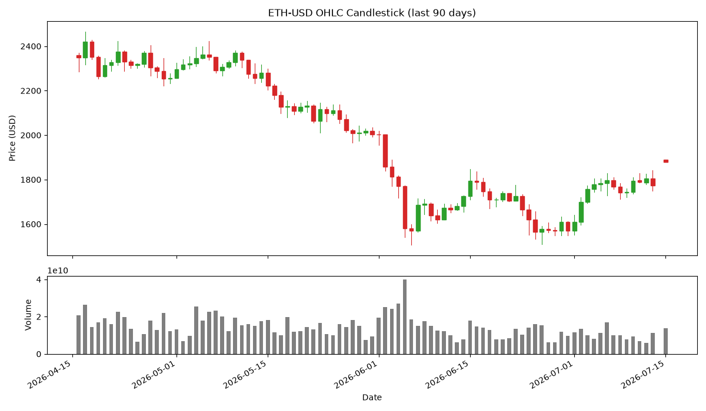
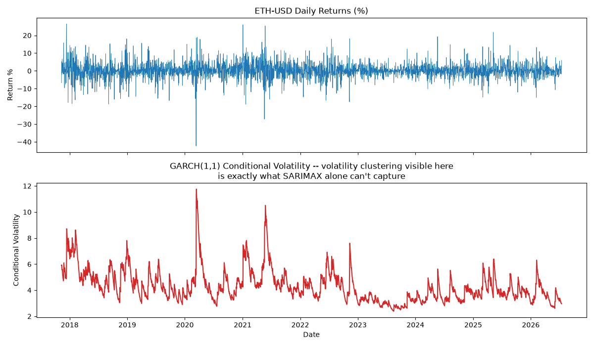
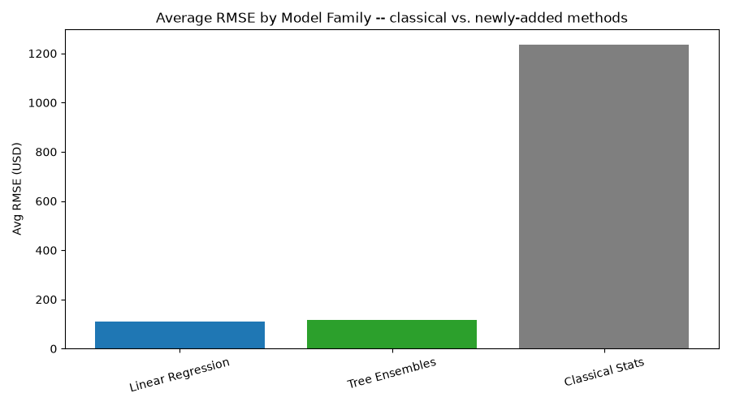
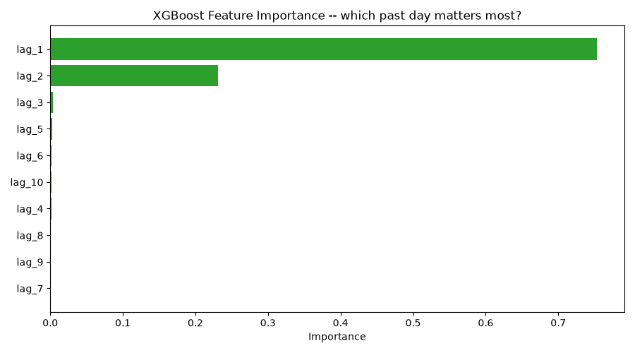
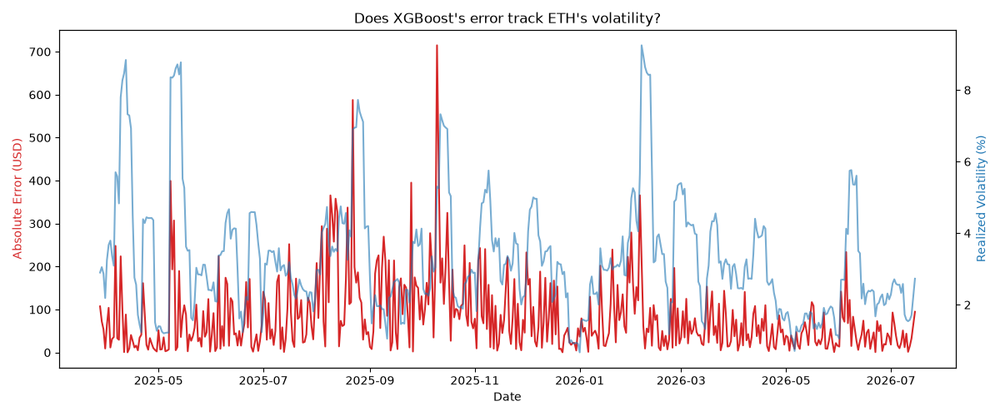

# ETH-Price-Prediction-ML-Project

A time-series & ML project predicting **Ethereum (ETH-USD)** prices.

## Visualizations

These are chosen to say something specific about *this* project, not just
generic time-series plots:

- **OHLC candlestick + volume** -- the raw data is OHLCV, so show it as OHLCV,
  not just a closing-price line



- **GARCH conditional volatility** -- the direct visual justification for why
  GARCH-SARIMAX exists in the model suite: ETH's volatility clustering is
  something plain SARIMAX can't capture on its own



- **Average RMSE by model family** -- the actual question this variation
  raises: do the newly-added tree ensembles and regression models beat the
  original project's classical time-series suite? Yes, by an order of
  magnitude (~$110 RMSE vs. ~$1,200), but not because they're inherently
  better forecasters of ETH. The classical family (AR, ARMA, ARIMA, SARIMAX,
  VAR) forecasts the *entire* held-out test period blind from a single point
  in time, so its errors compound over hundreds of days. The regression/tree
  models (ElasticNet, Bayesian Ridge, Polynomial Regression, Random Forest,
  XGBoost) instead predict only one day ahead at a time, using the *true*
  previous 10 days of closing prices as lag features -- a fundamentally
  easier task, and the real reason for the gap. (LSTM would be a fairer
  comparison against the lag-feature models since it's also windowed one-step
  prediction, but is excluded from this chart unless `tensorflow` is
  installed -- see Setup.)



- **XGBoost feature importance** -- which lagged day matters most when
  predicting tomorrow's close (yesterday's close alone accounts for ~99% of
  the importance, which is expected for a near-random-walk asset like ETH)



- **Prediction error vs. realized volatility** -- does XGBoost's error
  specifically get worse during ETH's volatile stretches?



*(Run `python data_loader.py`, then `python run_all.py` and `python visualize.py`, to regenerate these -- see below.)*

## Project Structure

```
data_loader.py       # pulls ETH-USD OHLCV data via yfinance
preprocessing.py      # cleaning, ADF stationarity test, differencing, lag features
utils.py              # RMSE/MAE/MAPE metrics + plotting helpers

auto_arima.py          # pmdarima grid search for best (p,d,q)
AR.py / ARMA.py / ARIMA.py / SARIMAX.py / GARCH_SARIMAX.py / var_model.py

elasticnet.py / bayesian.py / polyreg.py   # classical regression on lag features

random_forest.py       # NEW: tree ensemble
xgboost_model.py        # NEW: gradient boosting
lstm_model.py            # NEW: recurrent neural net on windowed sequences

run_all.py              # runs every model, prints leaderboard
```

## Setup

```bash
pip install -r requirements.txt        # full install, includes tensorflow (needed for lstm_model.py)
pip install -r requirements-core.txt   # everything except tensorflow, if you don't need the LSTM model
```

## How to Run

```bash
python data_loader.py     # fetch and cache ETH-USD data
python auto_arima.py      # (optional) find best ARIMA order, update ORDER constants
python run_all.py         # run every model, print the RMSE leaderboard, and save imgs/model_family_comparison.png
python visualize.py       # generate the remaining README plots (candlestick, GARCH volatility, feature importance, error vs volatility)
```

Or run any single model script directly, e.g. `python xgboost_model.py`.

## Models Used

- **Classical time series**: AR, ARMA, ARIMA, SARIMAX, GARCH+SARIMAX (volatility-adjusted), VAR
- **Classical regression**: ElasticNet, Bayesian Ridge, Polynomial Regression
- **Tree ensembles (new)**: Random Forest, XGBoost
- **Deep learning (new)**: LSTM

## Notes

- Data is fetched fresh from Yahoo Finance every time `data_loader.py` runs, so
  results will drift as more history accumulates -- unlike the original
  project's fixed CoinMarketCap snapshot.
- The train/test split is chronological (last 15% held out), never shuffled,
  since this is a time series.